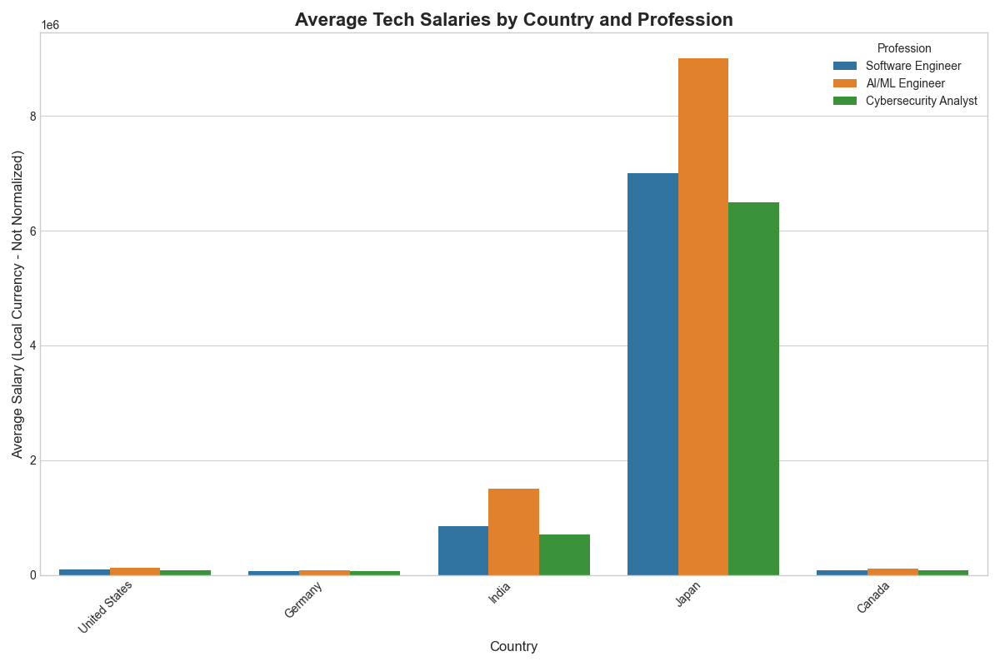

## Project Overview

This project analyzes and compares the average salaries for three key tech professions across five major countries. The goal is to provide a snapshot of the global compensation landscape for Software Engineers, AI/ML Engineers, and Cybersecurity Analysts.

The analysis was conducted using Python with the Pandas library for data manipulation and Matplotlib/Seaborn for visualization.

**Professions Analyzed:**
* Software Engineer
* AI/ML Engineer
* Cybersecurity Analyst

**Countries Surveyed:**
* United States
* Germany
* India
* Japan
* Canada

## Key Findings

The analysis reveals significant disparities in compensation based on both role and location. AI/ML Engineer consistently ranks as the highest-paid profession among the three. While the United States shows the highest nominal salaries, it's important to consider factors like cost of living and currency value for a true comparison.

## How to Run This Project

### Prerequisites
* Python 3.8+
* pip

### Setup and Execution

1.  **Clone the repository:**

    git clone <your-repository-url>
    cd <repository-name>
    

2.  **Create a `requirements.txt` file (if not present):**
    
    pip freeze > requirements.txt

3.  **Install dependencies:**
   
    pip install -r requirements.txt

4.  **Run the analysis:**
    The salary data for this project is pre-collected in `salary_data.csv`. To re-run the analysis and generate the chart, execute the following command:

    python analyze_data.py

## Data Source

The salary data was collected manually from **PayScale.com** in September 2025 to ensure accuracy, as direct web scraping was impeded by anti-bot measures.